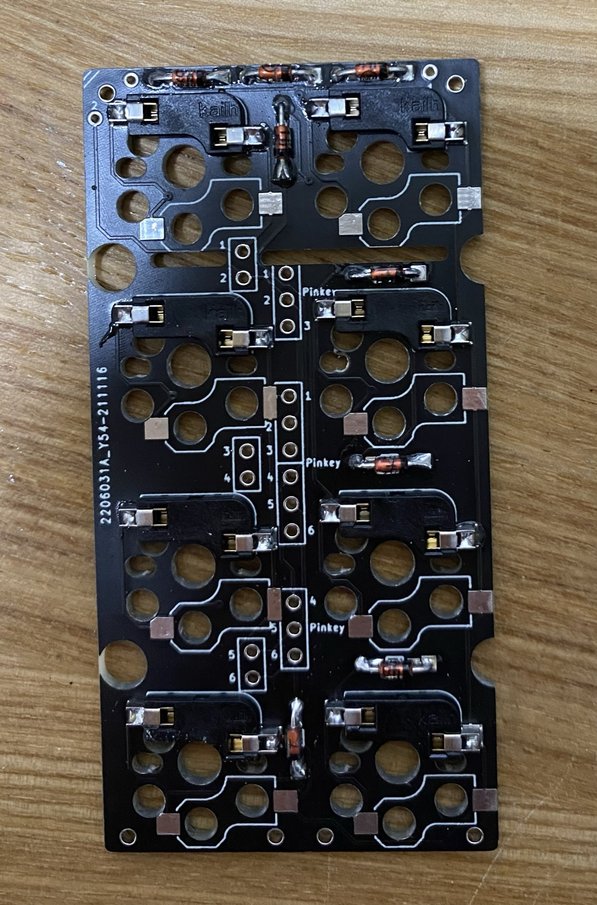
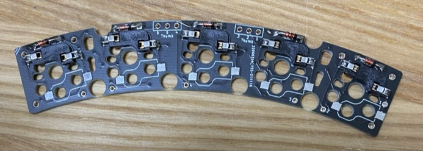
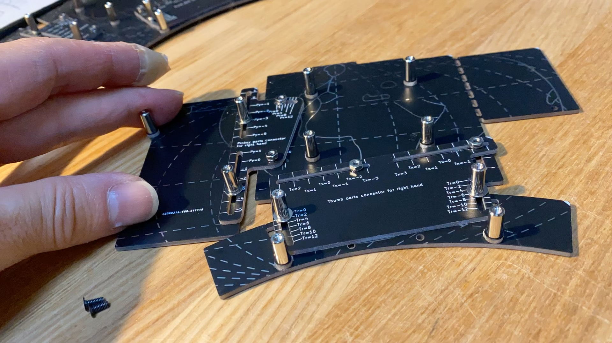

# Pangaea Build Guide for Testers

この文章は Panagea Keyboard を組み立てるための手引き書です。興味を持って頂いたテスター向けのガイドになります。

- [Pangaea Build Guide for Testers](#pangaea-build-guide-for-testers)
  - [完成イメージ](#完成イメージ)
  - [組み立て編](#組み立て編)
    - [クラスタ毎の組み立て](#クラスタ毎の組み立て)
    - [クラスタ間の信号接続](#クラスタ間の信号接続)
    - [ボトムプレートの組み立て](#ボトムプレートの組み立て)
    - [ボトムプレートへのPCB基板の取り付け](#ボトムプレートへのpcb基板の取り付け)
  - [調整編](#調整編)
  - [拡張編](#拡張編)
    - [Key の追加](#key-の追加)
    - [Rotary Encoder の追加](#rotary-encoder-の追加)
    - [Display の追加](#display-の追加)

## 完成イメージ

組み立てたときのイメージです。まだキーキャップは取り付けられていない状態です。

  

## 組み立て編

Pangaea Keyboard の特徴の一つは親指クラスタと小指クラスタの場所が調整できることです。そのメカ的な調整機構のために部品は大きく三つのクラスタに分かれています。

写真の左上がメインクラスタ、右上が小指クラスタ、下が親指クラスタのそれぞれのPCBです。
  

1. メインクラスタ (写真の左上)
2. 小指クラスタ   (写真の右上)
3. 親指クラスタ   (写真の下)

1.のメインクラスタは、キーで言うと上から2345/WERT/SDFG/XCVB の部分になります。

2.の小指クラスタは、標準では8個のキーで構成されます。オプションで最も外側のキーが下方向に下がった部品も用意される予定です。

3.の親指クラスタは、標準では5個のキーで構成されます。カスタマイズにより3個のキーあるいは4個のキーにキーの数を削減することもできます。

Pangaea では上記の親指クラスタ、小指クラスタの物理的な位置が調整できるようにするため、それぞれのクラスタを接続するコネクタ部品が用意されています。

組み立てにはそれらを信号としても物理的にも接続する必要があります。

それでは順に組み立てていきましょう。

### クラスタ毎の組み立て

基板とクラスタ間を接続した完成形はこちらです。左手側です。

  

基板の向きを間違えないようにするためのマークがPCBに印字されています。よく確認して右下に斜線のマークが来るように合わせましょう。

1.メインクラスタの組み立て

- ダイオード
- スイッチソケット
- Pro Micro (USB Type-Cタイプがおすすめ)
- Reset switch

こんな感じになります。Pro Microは上から見て左側に取り付けてください。

  

2.小指クラスの組み立て

- ダイオード
- スイッチソケット

こんな感じになります。

  

3.親指クラスタの組み立て

- ダイオード
- スイッチソケット

こんな感じになります。写真のサイズ感がおかしくてすみません。

  

これで三つのクラスタが用意できました。

それぞれ top plate にスイッチを挿入し、PCB に固定します。

### クラスタ間の信号接続

次にクラスタ同士の信号を接続します。

こちらが最終的に接続された状態です。

  

裏はこのようになっています。

  

1.メインと親指クラスタの接続

XHコネクタを持ちいた場合の実装例です。コネクタを使わずに直接、線をハンダ付けしてもかまいません。メイン基板と親指クラスタを接続します。配線はそれぞれ1-6の番号を対応させます。

2.メインと小指クラスタの接続
XHコネクタを持ちいた場合の実装例です。直接、線をハンダ付けしてもかまいません。

この状態で Firmware を書き込んで動作を確認します。一部のスイッチが入力できないなど問題があればハンダ付けをよく確認してください。

### ボトムプレートの組み立て 

次にボトムプレートを組み立てます。完成形はこのようになります。これがPangaeaたるゆえんです。小指クラスタ、親指クラスタが自由に調整できる機構が組み込まれています。

  

部品はこのようになっています。写真上が完成形です。

  

まずは、メインのボトムプレートを用意し、4つのネジを固定します。これはメイン基板を固定するためのネジです。PCBのスペーサを使って高さを上げます。ネジは M2 6mm がいいでしょう。5mmだとギリギリで、8mm だと一部干渉してしまいます。

次に、親指クラスタのボトムプレートを用意し、メインプレートと接続します。
接続部品はこちらです。

  

手前側はPCBのスペーサを使って高さを上げます。ネジは5mmを使います。

最後に、小指クラスタのボトムプレートを用意し、メインプレートと接続します。
接続部品はこちらです。

  

手前側はPCBのスペーサを使って高さを上げます。

こんな感じで調整できるようになっていると思います。

  

[**動画に差し替える**]
### ボトムプレートへのPCB基板の取り付け

ここまでできたら、スイッチがついたメイン基板、親指クラスタ、小指クラスタをボトムプレートの上に乗せてネジで固定します。
固定箇所はメイン、親指クラスタ、小指クラスタそれぞれが4箇所です。

![ [photo] 1](images/d52466fd30a9bd447ba011db17c6af2e1d6d6b381e681eb9b976b4c6a248406f.png)  

右側も同様に組み立てます。

  

キーキャップをはめて、左右をTRRSケーブルで接続したら完成です。

DROP の MT3 Black を取り付けたときの様子です。

  

## 調整編

完成したPangaea keyboard の価値は調整できることです。好きなように調整してください、なのですが、自由度が高すぎても困ると思いますので私の例で説明します。

+ 親指クラスタの調整
 - レイヤキーとの組み合わせ
   [詳細]
+ 小指クラスタの調整
 -　Control, Shift keyの位置
   [詳細]

 
## 拡張編

キーの追加、Rotary Encoder、OLED の追加方法について説明します。

Pangaea の設計は e3w2q さんなのです。つまり、SU120 の作者さんです。SU120 と組み合わせることで Function keyや Rotary Encoder などを自由に追加することができます。

作例はこちらです。
[photo]

### Key の追加

まずキーを追加します。

[詳細]

### Rotary Encoder の追加

次に Rotary Encoder を追加します。

[詳細]

### Display の追加

OLEDの表示例です。

[詳細]
