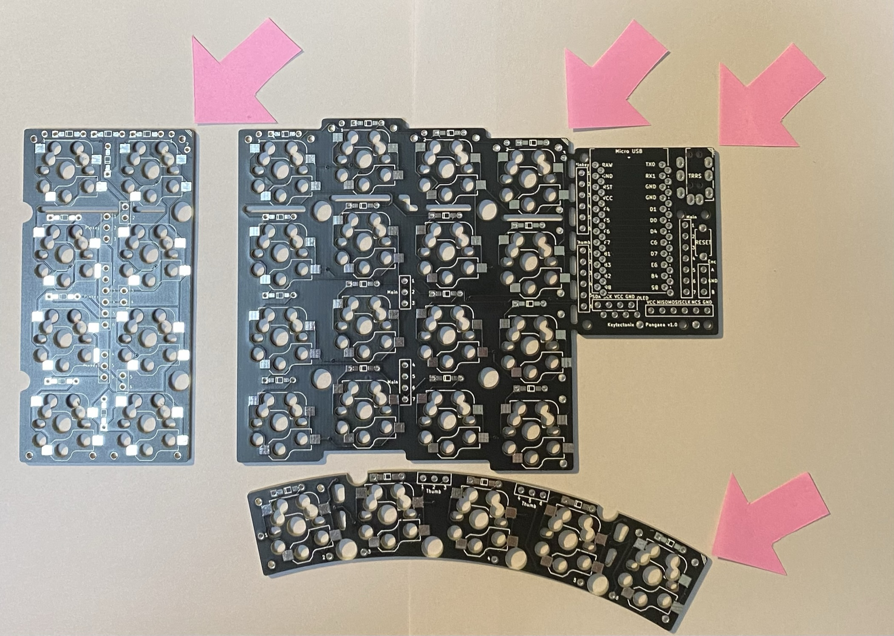
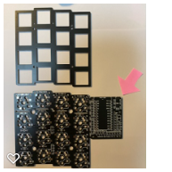
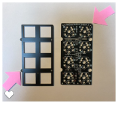
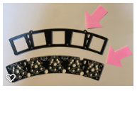
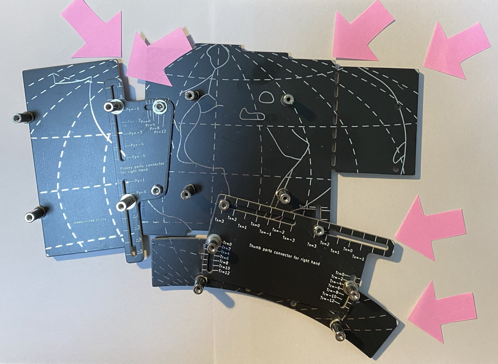

# Pangaea Build Guide for Beta Testers

この文章は Panagea Keyboard を組み立てるための手引き書です。興味を持って頂いたテスター向けのガイドになります。想定読者は、QMK を使ったことがある、キーボードを組み立てたことがある方になります。

なお、ハンダ付けは初めて、キーボードの software の QMK Firmware を触ったことがない方のガイドはなんらかの形で今後整備される予定です。

- [Pangaea Build Guide for Beta Testers](#pangaea-build-guide-for-beta-testers)
  - [完成イメージ](#完成イメージ)
  - [組み立て編](#組み立て編)
    - [クラスタ毎の組み立て](#クラスタ毎の組み立て)
    - [クラスタ間の信号接続](#クラスタ間の信号接続)
    - [ボトムプレートの組み立て](#ボトムプレートの組み立て)
    - [ボトムプレートへのPCB基板の取り付け](#ボトムプレートへのpcb基板の取り付け)
  - [調整編](#調整編)
  - [拡張編](#拡張編)
    - [Key の追加](#key-の追加)
    - [Rotary Encoder の追加](#rotary-encoder-の追加)
    - [Display の追加](#display-の追加)
  - [部品編](#部品編)

## 完成イメージ

組み立てたときの様子です。まだキーキャップは取り付けられていない状態です。

  

## 組み立て編

Pangaea Keyboard の特徴の一つは親指クラスタと小指クラスタの場所が調整できることです。そのメカ的な調整機構のために部品は大きく三つのクラスタに分かれています。

写真のPCBは左上がメインクラスタ、右上が小指クラスタ、下が親指クラスタです。

  

1.メインクラスタ (写真の左上)

- メインクラスタは、QWERTY配列のキーで言うと上から2345/WERT/SDFG/XCVB の部分になります。

2.小指クラスタ   (写真の右上)

- 小指クラスタは、標準では8個のキーで構成されます。
- 将来、オプションで最も外側のキーが下方向に下がった部品も用意される予定です。

3.親指クラスタ   (写真の下)

- 親指クラスタは、標準では5個のキーで構成されます。
- カスタマイズにより3個のキーあるいは4個のキーにキーの数を削減可能です。

Pangaea では上記の親指クラスタ、小指クラスタの物理的な位置が調整できるようにするため、それぞれのクラスタを接続するコネクタ部品が用意されています。組み立てにはクラスタ間を信号としても物理的にも接続する必要があります。

それでは順に組み立てていきましょう。

### クラスタ毎の組み立て

基板とクラスタ間を接続した完成形はこちらです。左手側です。

  

まずはクラスタ毎に組み立てていきます。基板の向きを間違えないようにするためのマークがPCBに印字されています。よく確認して右下に斜線のマークが来るように合わせましょう。

1.メインクラスタの組み立て

- ダイオード
- スイッチソケット
- Pro Micro (USB Type-Cタイプがおすすめ)
- Reset switch

左手用のメインクラスを裏から見た状態です。Pro Microは上から見て左側に取り付けます。

  

2.小指クラスの組み立て

- ダイオード
- スイッチソケット

こんな感じになります。
ダイオードは縦方向にも取り付ける必要があります。8個のダイオードが取り付けられているか確認しておきます。

  

3.親指クラスタの組み立て

- ダイオード
- スイッチソケット

こんな感じになります。ダイオードの方向に間違いがないか今一度確認したほうがよいでしょう。

  

これで三つのクラスタが用意できました。

それぞれトッププレートにスイッチを挿入し、PCB に固定します。それぞれのクラスタのトッププレートの方向です。

  

  

  

### クラスタ間の信号接続

次にクラスタ同士の信号を接続します。

こちらが最終的に接続された状態です。

  

裏はこのようになっています。

  

1.メインと親指クラスタの接続

XHコネクタを持ちいた場合の実装例です。高さを抑えるためにコネクタを使わずに直接、ケーブルをハンダ付けしてもかまいません。メイン基板と親指クラスタを接続します。配線はそれぞれ1-6の番号を対応させます。

2.メインと小指クラスタの接続
XHコネクタを用いた場合の実装例です。こちたも直接、線をハンダ付けしてもかまいません。
最終的な基板のレイアウトを確認して自然な方向となるようにハンダ付けすると断線のリスクが下がると思います。

この状態で Firmware を書き込んで動作を確認します。

QMK の directory に移動してから、

```console
$ cd qmk_firmware
```

ProMicro に firmware を書き込みます。Compileも一緒に行います。

```console
$ qmk flash -kb pangaea -km default
```

一部のスイッチが入力できないなど問題があればハンダ付けをよく確認してください。原因として考えられることとしては下記です。

1. ダイオードが取り付けられていない
2. ダイオードの方向が逆
3. スイッチソケットを逆に取り付けてそもそもスイッチが入らない
4. スイッチソケットのハンダ付けが不十分で接触不良
5. スイッチの足が折れていて正常に刺さっていない

そんなミスするわけない！などと言わずによく見てみましょう。

### ボトムプレートの組み立て

次にボトムプレートを組み立てます。完成形はこのようになります。これが Pangaeaたるゆえんです。小指クラスタ、親指クラスタが自由に調整できる機構が組み込まれています。

部品をピンクの矢印のところにPCBのマークがくるように並べます。

  


  

まずは、メインのボトムプレートを用意し、4つのネジを固定します。これはメイン基板を固定するためのネジです。PCBのスペーサを使って高さを上げます。ネジは M2 6mm がいいでしょう。5mmだとギリギリで、8mm だと一部PCB干渉して調整範囲に影響が出ます。

次に親指クラスタのボトムプレートを用意し、メインプレートと接続します。
接続部品はこちらです。

  

スタンドオフは9mmを使用しています。コネクタを使わずに直接配線する場合には3−4mmでも大丈夫でしょう。手前側はPCBのスペーサを使って高さを上げます。ネジは6mmを使います。

最後に、小指クラスタのボトムプレートを用意し、メインプレートと接続します。
接続部品はこちらです。

  

手前側はPCBのスペーサを使って高さを上げます。

それぞれの可動部分にはワッシャーとスプリングワッシャーを使うのがおすすめです。理由は組み立て後の稼働がスムーズになるためです。直接ネジ止めするとネジが緩みやすく、調整のためにドライバーでネジ止めすることになり不便に感じられると思います。ワッシャーとスプリングワッシャーを使うとある程度きつくネジを締めた状態で調整もできるため組み立て後の調整が楽になります。

こんな感じで調整できるようになっていると思います。動画です。

  

### ボトムプレートへのPCB基板の取り付け

ここまでできたら統合です。スイッチがついたメイン基板、親指クラスタ、小指クラスタをボトムプレートの上に乗せてネジで固定します。固定箇所はメイン、親指クラスタ、小指クラスタそれぞれが4箇所です。

![ [photo] 1](images/d52466fd30a9bd447ba011db17c6af2e1d6d6b381e681eb9b976b4c6a248406f.png)  

右側も同様に組み立てます。基板のマークが揃うように部品の方向に気をつけて組み立ててください。

  

キーキャップをはめて、左右をTRRSケーブルで接続したら完成です。

DROP の MT3 Black を取り付けたときの様子です。

  

## 調整編

完成したPangaea keyboard の価値は調整できることです。好きなように調整してください、なのですが、自由度が高すぎても困ると思いますので私の例で説明します。

- 親指クラスタの調整
- レイヤキーとの組み合わせ
詳細
- 小指クラスタの調整
-　Control, Shift keyの位置

## 拡張編

キーの追加、Rotary Encoder、OLED の追加方法について説明します。

Pangaea の設計は e3w2q さんなのです。つまり、SU120 の作者さんです。SU120 と組み合わせることで Function keyや Rotary Encoder などを自由に追加することができます。

作例はこちらです。
[photo]

### Key の追加

まずキーを追加します。

[詳細]

### Rotary Encoder の追加

次に Rotary Encoder を追加します。

[詳細]

### Display の追加

OLEDの表示例です。

[詳細]

## 部品編

標準構成での組み立てに必要な部品の一覧です。親指クラスタのキー数を減らす場合はその分、減少し 3キー構成ではマイナス4でそれぞれ54となります。

- ダイオード(スルーホールまたはchip部品) (4x4 + 4x2 + 1x5) x 2 = 58
- スイッチソケット (MXまたは choc 用) 29 x 2 = 58
- スイッチ  (MXまたは choc 用) 29 x 2 = 58
- Pro Micoro x 2
- 3.5mm TRRS ケーブル x 1
- USB ケーブル x 1
- スタンドオフ (9mm, コネクタを利用しない直接接続では4mm-5mm(未検証))
- M2 ネジ 6mm (5mmはちょっと不足ですが使えないことはないです) (16+18)x2
- M2 ナット (コネクタ4x2)

Rev.3では MXスイッチ利用時は、コネクタ部のナットとPCBが干渉するため高めになっています。

以下オプションです
- ワッシャー (使用するとスムーズに可動部分が動きます)
- スプリングワッシャー (使用するとネジが緩みにくくなるため強くおすすめです)
- XH 6ピンケーブル付コネクタ(使うと高さは出ますが配線や分解が楽です)
