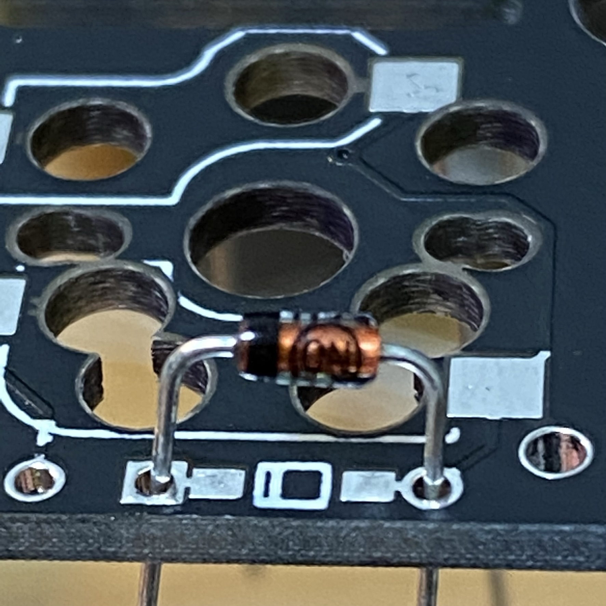

# Pangaea Build Guide for Beta Testers

この文章は Panagea Keyboard を組み立てるための手引き書です。興味を持って頂いたテスター向けのガイドになります。想定読者はキーボードキットを組み立てたことがある方になります。

なお、ハンダ付けは初めて、キーボードの software の QMK Firmware を触ったことがない方のガイドはなんらかの形で今後整備される予定です。

- [Pangaea Build Guide for Beta Testers](#pangaea-build-guide-for-beta-testers)
  - [完成イメージ](#完成イメージ)
  - [組立編](#組立編)
    - [クラスタ毎の組み立て](#クラスタ毎の組み立て)
    - [クラスタ間の信号接続](#クラスタ間の信号接続)
    - [動作確認](#動作確認)
    - [ボトムプレートの組み立て](#ボトムプレートの組み立て)
    - [ボトムプレートへのPCB基板の取り付け](#ボトムプレートへのpcb基板の取り付け)
  - [調整編](#調整編)
  - [拡張編](#拡張編)
    - [Key の追加](#key-の追加)
    - [Rotary Encoder の追加](#rotary-encoder-の追加)
    - [Display の追加](#display-の追加)
  - [部品編](#部品編)

## 完成イメージ

組み立てたときの様子です。まだキーキャップは取り付けられていない状態です。

  

## 組立編

Pangaea Keyboard の特徴の一つは親指クラスタと小指クラスタの場所が調整できることです。そのメカ的な調整機構のために部品は大きく三つのクラスタに分かれています。
また組み立ての順番を間違えると取り返しがつかないなどの構成にはなっていないため気楽に進められます。
つまり、ダイオード、スイッチをハンダづけてして、分割になっているところをケーブルで接続して、可動部品をネジ止めし、スイッチを取り付けて終わりです。

用語を確認します。
写真のPCBは左上がメインクラスタ、右上が小指クラスタ、下が親指クラスタです。

  

1.メインクラスタ (写真の左上)

- メインクラスタは、QWERTY配列のキーで言うと上から2345/WERT/SDFG/XCVB の部分になります。

2.小指クラスタ   (写真の右上)

- 小指クラスタは、標準では8個のキーで構成されます。
- 将来、オプションで最も外側のキーが下方向に下がった部品も用意される予定です。

3.親指クラスタ   (写真の下)

- 親指クラスタは、標準では5個のキーで構成されます。
- カスタマイズにより3個のキーあるいは4個のキーにキーの数を削減可能です。

Pangaea では上記の親指クラスタ、小指クラスタの物理的な位置が調整できるようにするため、それぞれのクラスタを接続するコネクタ部品が用意されています。組み立てにはクラスタ間を信号としても物理的にも接続する必要があります。

それでは順に組み立てていきましょう。

### クラスタ毎の組み立て

基板とクラスタ間を接続した完成形はこちらです。左手側です。

  

まずはクラスタ毎に組み立てていきます。基板の向きを間違えないようにするためのマークがPCBに印字されています。よく確認して右下に斜線のマークが来るように合わせましょう。

1.メインクラスタの組み立て

- ダイオード

ダイオードの方向は、PCB上の白い線と、ダイオードの黒い線を合わせます。

  
- スイッチソケット
- Pro Micro (USB Type-Cタイプがおすすめ)
- Reset switch
- 3.5mm ジャック

左手用のメインクラスタを裏から見た状態です。Pro Micro は上から見て左側に取り付けます。3.5mm ジャッ、Reset Switch も取り付けます。

  

2.小指クラスの組み立て

- ダイオード
- スイッチソケット

こんな感じになります。
ダイオードは縦方向にも取り付ける必要があります。8個のダイオードが取り付けられているか確認しておきます。

  

3.親指クラスタの組み立て

- ダイオード
- スイッチソケット

こんな感じになります。ダイオードの方向に間違いがないか今一度確認したほうがよいでしょう。

  

これで三つのクラスタが用意できました。

それぞれトッププレートにスイッチを挿入し、PCB に固定します。それぞれのクラスタのトッププレートの方向です。

  

  

  

### クラスタ間の信号接続

次にクラスタ同士の信号を接続します。

こちらが最終的に接続された状態です。

  

裏はこのようになっています。

  

1.メインと親指クラスタの接続

XHコネクタを持ちいた場合の実装例です。高さを抑えるためにコネクタを使わずに直接、ワイヤをハンダ付けしてもかまいません。メイン基板と親指クラスタを接続します。配線はそれぞれ1-6の番号を対応させます。あまりワイヤが短いと調整の時に引っ張ってしまって可動域に制約が出たり、ワイヤが切れたりします。少なくとも11cm程度の長さを確保したほうがよいです。余り長くても邪魔になりますのでボトムプレートと組み合わせて確認してみるとよいと思います。

2.メインと小指クラスタの接続

XHコネクタを用いた場合の実装例です。こちたも直接ワイヤをハンダ付けしてもかまいません。最終的な基板のレイアウトを確認して自然な方向となるようにハンダ付けすると断線のリスクが下がると思います。

### 動作確認

この状態で Firmware を書き込んで動作を確認します。全て組み立ててからでもよいですが、配線にミスなどがあると再度分解することになります。自信がある方はここをスキップして、ボトムプレートの組み立てに進みましょう。

QMK の directory に移動してから、

```sh
$ cd qmk_firmware
```

ProMicro に firmware を書き込みます。Compileも一緒に行います。

```sh
$ qmk flash -kb pangaea -km default
```

一部のスイッチが入力できないなど問題があればハンダ付けをよく確認してください。原因として考えられることとしては下記です。

- ダイオードが取り付けられていない
- ダイオードの方向が逆に取り付けられている
- スイッチソケットを逆に取り付けていて、そもそもスイッチが刺さっていない
- スイッチソケットのハンダ付けが不十分で、接触不良
- スイッチの足が折れていて、正常にスイッチソケットに刺さっていない
   
そんなミスするわけない！などと言わずによく見てみましょう。

### ボトムプレートの組み立て

次にボトムプレートを組み立てます。完成形はこのようになります。これが Pangaeaたるゆえんです。小指クラスタ、親指クラスタが自由に調整できる機構が組み込まれています。

部品をピンクの矢印のところにPCBのマークがくるように並べます。

  


  

まずは、メインのボトムプレートを用意し、4つのネジを固定します。これはメイン基板を固定するためのネジです。PCBのスペーサを使って高さを上げます。ネジは M2 6mm がいいでしょう。5mmだとギリギリで、8mm だと一部PCB干渉して調整範囲に影響が出ます。

次に親指クラスタのボトムプレートを用意し、メインプレートと接続します。
接続部品はこちらです。

  

スタンドオフは9mmを使用しています。コネクタを使わずに直接配線する場合には3−4mmでも大丈夫でしょう。手前側はPCBのスペーサを使って高さを上げます。ネジは6mmを使います。

最後に、小指クラスタのボトムプレートを用意し、メインプレートと接続します。
接続部品はこちらです。

  

手前側はPCBのスペーサを使って高さを上げます。

それぞれの可動部分にはワッシャーとスプリングワッシャーを使うのがおすすめです。理由は組み立て後の稼働がスムーズになるためです。直接ネジ止めするとネジが緩みやすく、調整のためにドライバーでネジ止めすることになり不便に感じられると思います。ワッシャーとスプリングワッシャーを使うとある程度きつくネジを締めた状態で調整もできるため組み立て後の調整が楽になります。

こんな感じで調整できるようになっていると思います。動画です。

  

### ボトムプレートへのPCB基板の取り付け

ここまでできたら統合です。スイッチがついたメイン基板、親指クラスタ、小指クラスタをボトムプレートの上に乗せてネジで固定します。固定箇所はメイン、親指クラスタ、小指クラスタそれぞれが4箇所です。

![ [photo] 1](images/d52466fd30a9bd447ba011db17c6af2e1d6d6b381e681eb9b976b4c6a248406f.png)  

右側も同様に組み立てます。基板のマークが揃うように部品の方向に気をつけて組み立ててください。

  

キーキャップをはめて、左右をTRRSケーブルで接続したら完成です。

DROP の MT3 Black を取り付けたときの様子です。

  

## 調整編

完成したPangaea keyboard の価値は調整できることです。好きなように調整してください、なのですが、自由度が高すぎても困ると思いますので私の例で説明します。

これが便利です。

PCB Wrench [Photo]

私の調整した結果を例として写真を掲載します。[PHOTO]

- メインクラスタの調整

メインクラスタはz軸方向の高さ調整が可能です。中心方向の2本のスタンドオフを高くし、中心に向かってチルトさせることができます。

また左右のメインクラスタ間の調整用にscaleが用意されています。
ある程度固定次第長さに切って使用するとよいでしょう。

- 親指クラスタの調整
  
親指クラスタはx,y軸方向とz軸方向の調整ができます。
x,y軸方向はTy-=-1〜1 でかつTx =- -1〜3の範囲で調整できます。
また、z軸方向はスタンドオフの長さをメインクラスタに比べて少し低くするといった工夫も可能です。親指だけchocにして高さを抑えることもできます。

- 小指クラスタの調整

小指クラスタは、左側であれば Pr=0〜12度の回転、Py=-5〜-1 の範囲で調整ができます。

## 拡張編

キーの追加、Rotary Encoder、OLED の追加方法について説明します。

Pangaea の設計は e3w2q さんなのです。つまり、SU120 の作者さんです。SU120 と組み合わせることで Function keyや Rotary Encoder などを自由に追加することができます。

作例はこちらです。
[photo]

### Key の追加

まずキーを追加します。

[詳細]

### Rotary Encoder の追加

次に Rotary Encoder を追加します。

[詳細]

### Display の追加

OLEDの表示例です。

[詳細]

## 部品編

標準構成での組み立てに必要な部品の一覧です。親指クラスタのキー数を減らす場合はその分が減少することになり、片手3キー構成では左右でマイナス2ずつででそれぞれ54となります。

- ダイオード(スルーホールまたはchip部品) (4x4 + 4x2 + 1x5) x 2 = 58
  - 1N4148
    - https://akizukidenshi.com/catalog/g/gI-00743/
  - SMD
    - Google it.
- スイッチソケット (MXまたは choc 用) 29 x 2 = 58
  - Kailh Hot-Swappable PCB Socket
    - Google it.

- スイッチ  (MXまたは choc 用) 29 x 2 = 58
  - Cherry MX 互換スイッチ、5pin が安定です。お好きなモノで
  - choc スイッチ
    - Google it.

- Pro Micoro x 2
  - https://www.switch-science.com/catalog/6228/

- Reset switch x 2
  - タクトスイッチ
  - https://akizukidenshi.com/catalog/g/gP-08074/

- 3.5mm TRRS ケーブル x 1
  - Google it.

- USB ケーブル x 1
  - Google it.

- M2 スタンドオフ (9mm, XHコネクタを利用しない直接接続では4mm-5mm(未検証)
  - ARB-2009E
  - https://www.hirosugi-net.co.jp/shop/g/g2396/

- M2 ネジ 6mm 
  - (5mmはちょっと不足ですが使えないことはないです) (16+18)x2
  - F-0206-E, 6mm
  - https://www.hirosugi-net.co.jp/shop/g/g36907/
  - 見える部分には低背のこちらが見かけがよいです。また背面にも高さが出ないでないためおすすめです。しかしながら、rev.3では8mmを使うと干渉するため、5mmでがんばって使えばすべてこのネジでも大丈夫です。コネクタ部分に使う長さのおすすめはワッシャ、スプリングワッシャを考慮すると6mmです。5mmでは長さが不足します。ワッシャだけ、あるいはスプリングワッシャだけなら5mmで大丈夫ですが効果が薄れます。
    - FX-0250EB 5mm 鉄(三価クロメート黒色) ＋低頭精密小ねじ
    - https://wilco.jp/products/F/FX-EB.html#page3
- M2 ナット (コネクタ部品用 4x2)
   - BNT-02
   - https://www.hirosugi-net.co.jp/shop/g/g37954/


Rev.3では MXスイッチ利用時は、コネクタ部のナットとPCBが干渉するため高めになっています。

以下オプションです

- ワッシャ
  - 使用するとスムーズに可動部分が動きます
  - スプリングワッシャと組み合わせて使うと緩みがなく、かつ、可動部分を動かしやすくなります。
    - Google it.

- スプリングワッシャ
  - 使用するとネジが緩みにくくなるため強くおすすめです
    - Google it.

- XH 6ピンケーブル付コネクタ(使うと高さは出ますが配線や分解が楽です)
    - Google it.
    - 長さ15cm−20cm程度のものが販売されています。もちろん自分でワイヤに端子を固定してケーブル自作もできますが時間もかかりますし専用の工具も必要になります。

